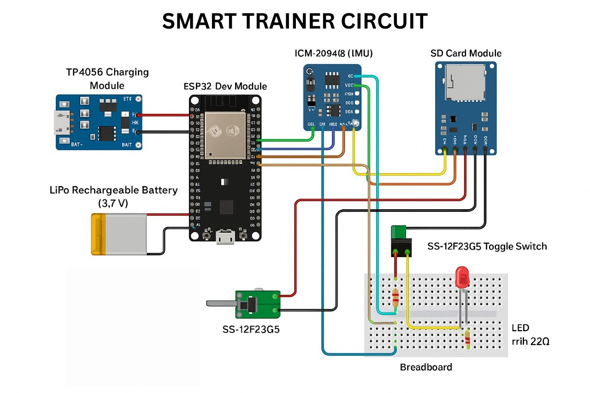

# Smart Trainer: AI-Powered Biomechanics Dashboard


**Smart Trainer** is a full-stack, hardware-to-cloud fitness ecosystem. It captures physical movement via a custom-built IoT wearable, processes the kinematics through a Python Machine Learning microservice, and visualizes real-time form feedback on an interactive React dashboard.

---

## 📸 Project Showcase

| Hardware Setup |
| :---: | 
|  | 
| *ESP8266 + ICM-20948 IMU* |

---

## 🚀 Key Features

* **Custom IoT Wearable:** C++ firmware running on an ESP8266, sampling 9-axis IMU data (ICM-20948) at ~66Hz with local SD card logging.
* **3-Layer Anomaly Detection Pipeline:** 
  1. **Physics/Rule-Based Engine:** Detects severe form breaks (Jerk spikes, asymmetric tempo, short ROM).
  2. **Statistical Outliers:** Applies IQR (Interquartile Range) to dynamically find reps that deviate from a user's session baseline.
  3. **Machine Learning:** Utilizes an Unsupervised `One-Class SVM` to detect subtle biomechanical instability across a rep's entire feature vector.
* **Full-Stack Web App:** A Node/Express gateway handles file routing and PostgreSQL persistence, while a React frontend provides drag-and-drop uploads and interactive kinematic charts (via `recharts`).

---

## 🧠 System Architecture

The project is split into a **Monorepo** containing three distinct services:

### 1. Hardware (`/hardware`)
* **Microcontroller:** ESP8266 (NodeMCU / Wemos D1 Mini)
* **Sensor:** Adafruit ICM-20948 (9-DOF IMU) + Madgwick AHRS Filter
* **Features:** Hardware toggle switch between "Live Web UI" mode (real-time charting via captive portal) and "SD Logging" mode (10Hz CSV writing for ML training).

### 2. ML Microservice (`/ml-service`)
* **Framework:** Python, FastAPI, Pandas, Scikit-Learn, SciPy
* **Logic:** Accepts raw CSV uploads, applies adaptive smoothing filters to accelerometer data to calculate elbow angle, segments data into reps via peak detection, and runs the 3-Layer Scoring Algorithm. Returns a heavily structured JSON diagnostic report.

### 3. Web Dashboard (`/backend` & `/frontend`)
* **Backend:** Node.js, Express, Multer. Acts as an API Gateway, proxying files to the ML service and saving workout summaries (Total Reps, Avg Score) into a **PostgreSQL** database.
* **Frontend:** React, Vite, Axios, React-Dropzone, Recharts. Renders form analysis (Elbow Angle ° over time) and overlays ML Outliers directly onto the Gyroscope magnitude plot.

---

## 🛠️ Getting Started (Local Development)

### Prerequisites
1. Node.js (v18+)
2. Python (3.9+)
3. PostgreSQL running locally

** 1. Clone the Repository **
```bash
git clone [https://github.com/Saumya2721/smart-trainer.git](https://github.com/Saumya2721/smart-trainer.git)
cd smart-trainer

** 2. Set up the ML Microservice **
```bash
cd ml-service
python -m venv venv
source venv/bin/activate  # On Windows use: venv\Scripts\activate
pip install -r requirements.txt
uvicorn main:app --reload --port 8000

** 3. Set up the Node Backend **
```bash
cd backend
npm install
# Create a .env file and add your PostgreSQL credentials & PYTHON_API_URL=http://localhost:8000/api/analyze
npm run dev

** 4. Set up the React Frontend **
```bash
cd frontend
npm install
npm run dev

### Future Roadmap
Implement robust Quaternion math for full 3D spatial tracking.

Add live WebSocket streaming directly from the ESP8266 to the React frontend.

Expand ML model to classify different exercise types automatically (e.g., Hammer Curl vs. Biceps Curl).

Build user authentication for personal workout history tracking.
